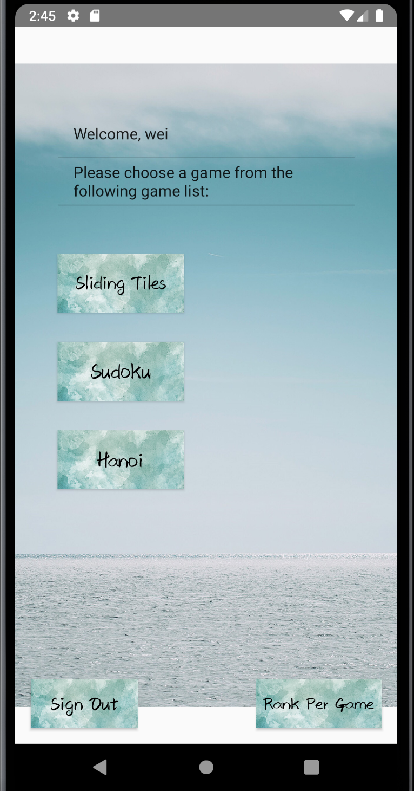
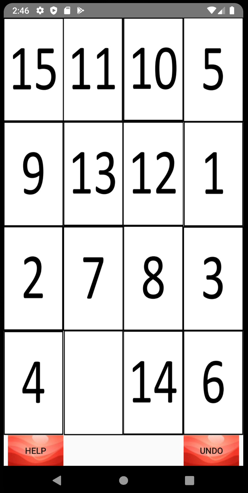
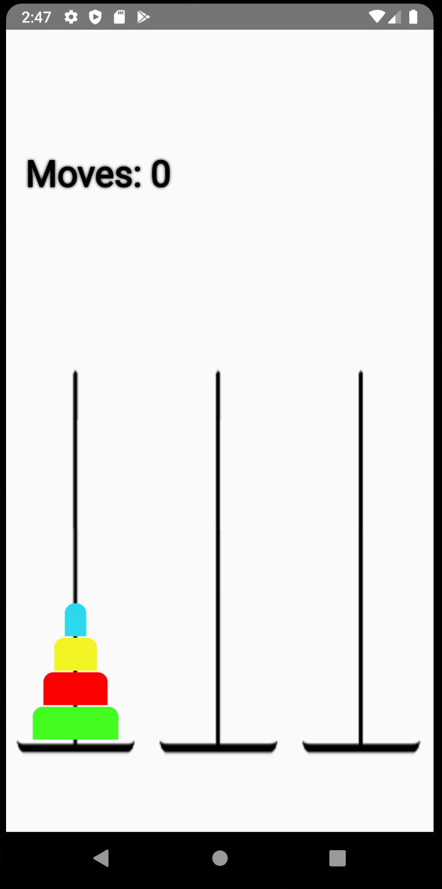

### Android Studio setup instructions
##### Process to create project
 - Open Android Studio.
 - Under `File` in tool bar, choose `Close Project` to close currently opened project. __(You would only need to do this step if you have already opened some other project)__
 - On starting page, click `Check out project from version control`, and choose `Git`.
 - Copy and paste URL, click `test` to check its functionality.
 - Click `Clone`, when asking whether creating a new project, choose `no`.
 - After clone process finished, click `Open an existing Android Studio project`. Find the cloned project and open the following route: `...\GameCenter`, then click `ok` to open the project.
 - Wait for Android Studio to build the project.
 - Now you should create the project successfully!
---
### Introduction to this project
 - This project implements an android app: __Game Center__.
 - __Game Center__ provides several games for users to play. 
   (The games provided are _Sliding Tiles_，_Sudoku_ and  _Hanoi_)
##### Basic Functions
1. __User manage system:__ allow players to register and login.
 - Once __Game Center__ is started, it will ask user to login by showing it as first page. If given _username_ does not exist, or given _username_ does exists but given _password_ does not match, it will give a warning.
 - During __register__ processing, system will check several things: whether the entered _username_ is already exist, whether the entered _password_ matches entered _confirm password_, only when there is no conflict can a new user register successfully.
2. __Score Board:__ display the best 3 scores.
 - This program provides 2 kinds of score boards: one based on _game_ and another based on _user_.
 - Score board based on _games_ will give the best 3 scores it recorded for each game. _Username_ will be shown first, followed by one _score_, line by line.
 - Score board based on _users_ will only show the best 3 scores for the current user, also classified by games.
 - For game _SlidingTiles_, _Sudoku_ and _Hanoi_, lower score means better performance since we get our score depending on the number of steps the user goes or the total time the user spend to win the game.
3. __Difficulty Setting:__ Choose difficulty when starting a new game.
 - For game _SlidingTiles_ and _Hanoi_: difficulty is differed by choosing 3x3, 4x4, or 5x5 board and easy, medium, hard respectively. The bigger the number is, the more tiles will be contained in the sliding tiles board. The harder the game is, the more disks will be contained in the Hanoi game interface. And we treat the game with different difficulties as different games for the later visualization of the scoreboard.
4. __Auto Save:__ Save game progress in real-time.
 - For game _SlidingTiles_ and _Sudoku_, auto-save system will save player's progress after each _swap_ process.
 - This makes sure that one player will not lose his/her game progress if the app is shut down accidentally.
 - The player can always use _Load Saved Game_ to find their progress.
5. __Undo:__ allow user to return to earlier game state and perform better operations
 - For game _SlidingTiles_: _undo_ button allows players to cancel their moving steps, by 'unswapping' swapped tiles, one by one.
 - For game _Sudoku_: _undo_ button allows players to return the tile tapped and filled with number to its original condition, by filled the content of the tiles back, one by one.
6. __Solvable:__ the sliding tile puzzle app will always create solvable boards.
##### Great Features
 - __Game Info:__ give player a brief introduction about _rules_ and _marking scheme_ of each game.
 - __Unlimited Undo:__ allow players to back to wherever they want.
   (Most of the time having a second chance is better than not ~)
 - __Sign out:__ allow current user to change to a different account when program is running, instead of shutting down the program and restart.
 - __Displayable score:__ The game Sudoku shows the time the user has spent, right on the game interface. The game Hanoi shows the movement of disks the user has displayed, right on the game interface. So the users will know their current state.
##### Screenshots

